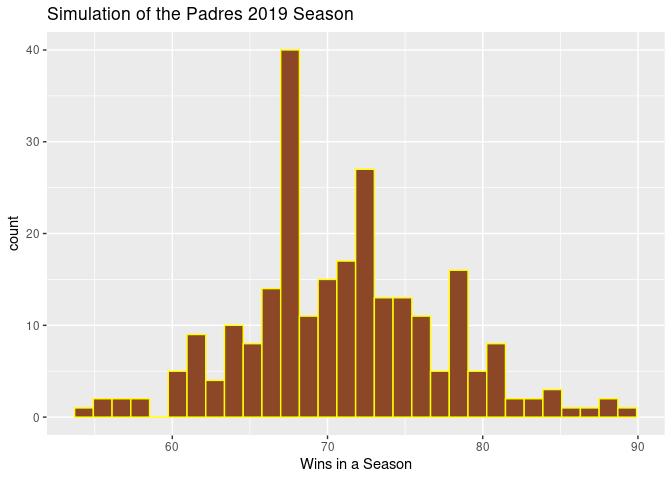
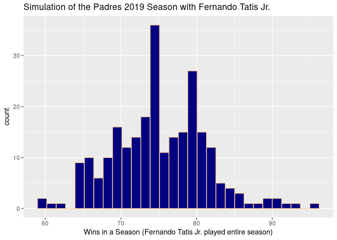

Summary of Findings
================

## Comparison of the Padres’ 2019 Season with their best hitter injured and uninjured

### Histogram of the Padres’ 2019 Season with their best hitter injured and taken out of the second half of games in the season

<!-- -->

The Padres won 70 games in the 2019 season. We simulated 250 seasons and
found an average of 71.08 games won per season. Fernando Tatis Jr. was
injured during the season and was replaced in the line-up.

Tatis Jr. is the Padres’ best hitter and we wanted to know, if he hadn’t
been injured, would the Padres have made it to the
playoffs?

### Histogram of the Padres’ 2019 Season with their best hitter able to play all 162 games

<!-- -->

In order to get into the playoffs, a team needed 90 wins. Our simulation
finds if Fernando Tatis Jr. had not been injured, the Padres’ would have
won an average 75.108 games. It seems that even if their best hitter had
not been injuired, they would not have made it to the playoffs in 2019, although 
they did reach the playoffs in a few of the simulated seasons.
