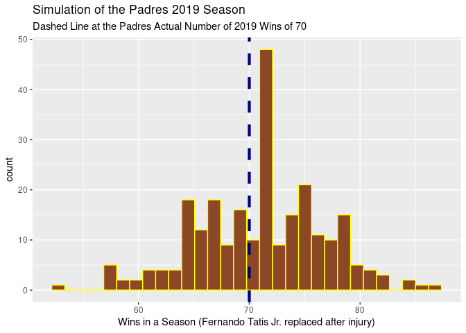

Analysis Plot
================

``` r
seasonsim <- read_csv(here("data","seasonsim.csv"))
```

    ## Parsed with column specification:
    ## cols(
    ##   season = col_double()
    ## )

``` r
ggplot()+
  geom_histogram(aes(x = seasonsim$season), col = "yellow", fill = "brown") +
  xlab("Wins in a Season") +
  ggtitle("Simulation of the Padres 2019 Season")
```

    ## `stat_bin()` using `bins = 30`. Pick better value with `binwidth`.

<!-- -->

``` r
mean(seasonsim$season)
```

    ## [1] 70.856
